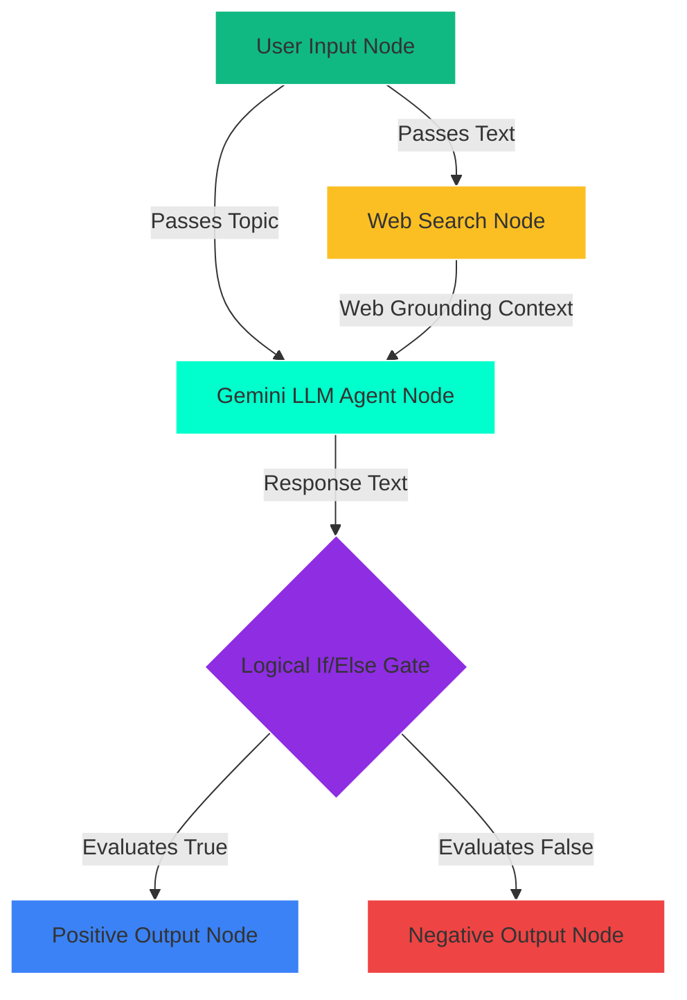

# 🚀 NovaFlow — Visual Node-Based AI Agent Workflow Orchestrator

[](https://react.dev/)
[](https://www.typescriptlang.org/)
[](https://vite.dev/)
[](https://opensource.org/licenses/MIT)

**NovaFlow** is a premium, interactive, drag-and-drop workspace that lets developers design, connect, and simulate executions of multi-agent LLM workflows. It runs prompt pipelines, integrates live web search grounding, executes custom JavaScript processors, and visualizes system logs and performance analytics in a stunning neon-themed dark interface.

> [!NOTE]
> **Built From Scratch**: Unlike standard canvas applications, NovaFlow does not rely on third-party node engines (like React Flow). The entire zooming, panning, drag-to-connect line rendering (SVG Bezier curves), and layout snapping grid were built using Vanilla CSS and React.

---

## ✨ Features

- 🎮 **Bespoke Canvas Viewport**: Smooth scroll-wheel zooming and middle-click/background drag panning with clamp guards. Responsive connection vectors sitting exactly on node borders.
- 🔗 **Dynamic Pin Manifestation**: Writing `{{variable}}` inside prompt templates automatically generates input pins on the node, allowing live upstream data connections.
- 🧠 **Robust Execution Driver**: A topological-sorting engine that traverses workflows asynchronously. Features logical split gates (If/Else), JS sandboxed processors, web searches, and outputs.
- ⚡ **Direct API Integration**: Connects with official Google Gemini APIs if an API key is provided, with an automatic fallback to high-fidelity, content-sensitive local simulation.
- 📊 **Custom SVG Charts Dashboard**: Track pipeline latencies (Line graph) and token splits by model (Donut chart) built entirely with pure SVG paths—no external charting packages needed.
- 📋 **Integrated Developer Console**: High-contrast monospace CLI panel streaming execution success, warning, and error vectors in real-time.

---

## 🛠️ Technology Stack

- **Core**: React + TypeScript + Vite.
- **Styling**: Vanilla CSS (Custom variable design system tokens, responsive flex grids, keyframes, and frosted glass backdrops).
- **Icons**: Lucide Icons.

---

## 🗺️ Pipeline Architecture



---

## 🚀 Getting Started

### Prerequisites
Make sure you have [Node.js](https://nodejs.org/) installed.

### 1. Clone & Install
```bash
git clone https://github.com/buildbyabhi/novaflow.git
cd novaflow
npm install
```

### 2. Run Local Development Server
```bash
npm run dev
```
Open **http://localhost:5173** to run the workspace.

### 3. Build for Production
To compile and output a production bundle (`dist` containing minified HTML, CSS, and JS):
```bash
npm run build
```

---

## 🎛️ Node Config Reference

| Node Type | Standard Inputs | Standard Outputs | Configurations |
| :--- | :--- | :--- | :--- |
| **User Input** | None | `output` | Multi-line textarea prompt source. |
| **LLM Agent** | Dynamic (`{{var}}`) | `response` | Model dropdown, Temperature slider, prompt template. |
| **Web Search** | `query` | `results` | Simulated engine settings, fallback query textbox. |
| **JS Sandbox** | `input_text` | `output` | Inline JavaScript code block (e.g. `return inputs.input_text.toUpperCase();`). |
| **Condition Gate** | `input_data` | `true` / `false` | Operators (`equals`, `contains`, `> `, `< `), comparison value. |
| **Final Output** | `input_data` | None | Read-only compilation results with Copy to Clipboard utility. |

---

## 📄 License
This project is licensed under the MIT License - see the LICENSE file for details.
